# shader demo 基于自改版本的quick-cocos-community 3.6.1
shader出处来自九尾狐游戏工作室，他们做了个用cocos creator的版本，地址是：
### [github项目地址 传送门](https://github.com/fylz1125/ShaderDemos)
### [码云项目地址 传送门](https://gitee.com/darkmoon/ShaderDemos)
我们公司用的是quick cocos进行开发，我相信很多小团队都是喜欢使用lua开发游戏，简单方便容易上手，热更也不需要头疼，但是quick已经被cocos抛弃，后序更新我都没关注过，基本有bug就自己魔改。现在我传到网上的quick项目是我魔改过后的一部分内容的版本（地址在下边）。
但是上面项目是用creator的，对lua开发者不适用，于是我就想到了转移到lua代码。

## 2018-08-29更新
反色shader出自[SHADER简单样例](http://codercdy.com/2015/12/05/shaderjian-dan-yang-li/)

# 本项目地址
### [码云版本 传送门](https://gitee.com/xianwx/quick_cocos_shader_demo)
### [coding版本 传送门](https://coding.net/u/xianwx/p/ShaderDemo/git)
### [github版本 传送门](https://github.com/xianwx/QuickCocosShader)

# 开发工具
## 2018-08-29更新
真实光照需要支持，如果是用的我魔改过后的quick项目编译出来的player是可以直接跑的（见下方），如果不想用，请参考
[支持模拟真实光照的commit](https://coding.net/u/xianwx/p/my_quick_3.6/git/commit/8c8c17d90a646bec012474ade587b6ad6e29aa54)自己导出一下接口即可。

quick-cocos-community 3.6.1，自己开放了GLProgram的接口，如果不使用这个player的话，可能会有报错，不想用可以自己魔改自己的引擎，只要接口都有就可以。
## 可以自己魔改
[魔改方法](http://xianwx.xyz/2018/08/22/quick-cocos-GLProgram/)

## 也可以用我魔改过后的版本
[quick coding 传送门](https://coding.net/u/xianwx/p/my_quick_3.6/git)
我实在是传不到github来，各种代理大法都试过了。。。改host大法也试过了，反正就是。。。传不动，气死。

# 代码
可以自己新建一个新的项目，然后把这个项目里的res和src拷贝过去，这样你就可以在手机上跑了，我在我自己的苹果手机上跑过，效果还可以的。实现主要看src/app/layer/EffectLayer.lua就可以了，shader的使用全在src/app/effect/里边，shader在src/app/shader/里边。

# 效果图
## 2018-08-29更新
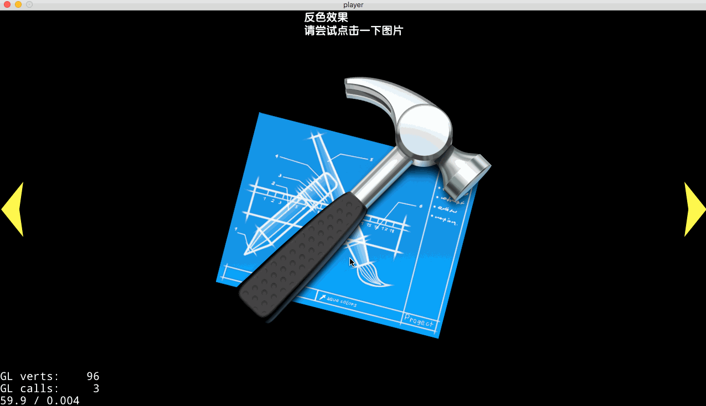

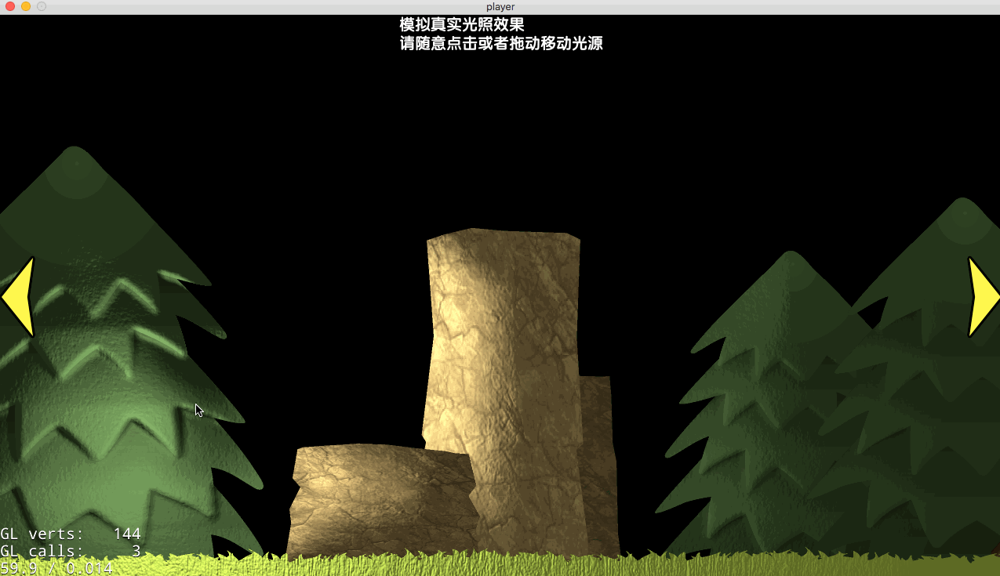

## 初期项目效果
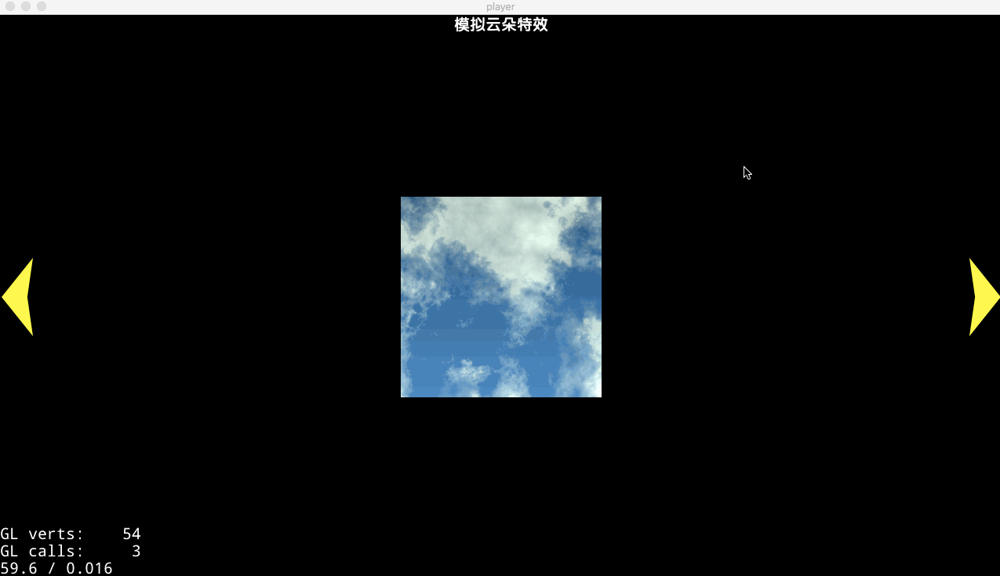

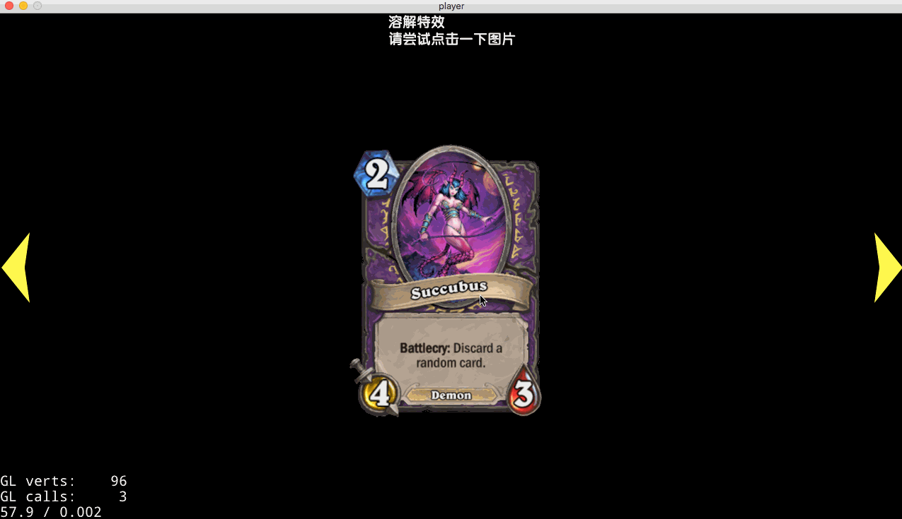

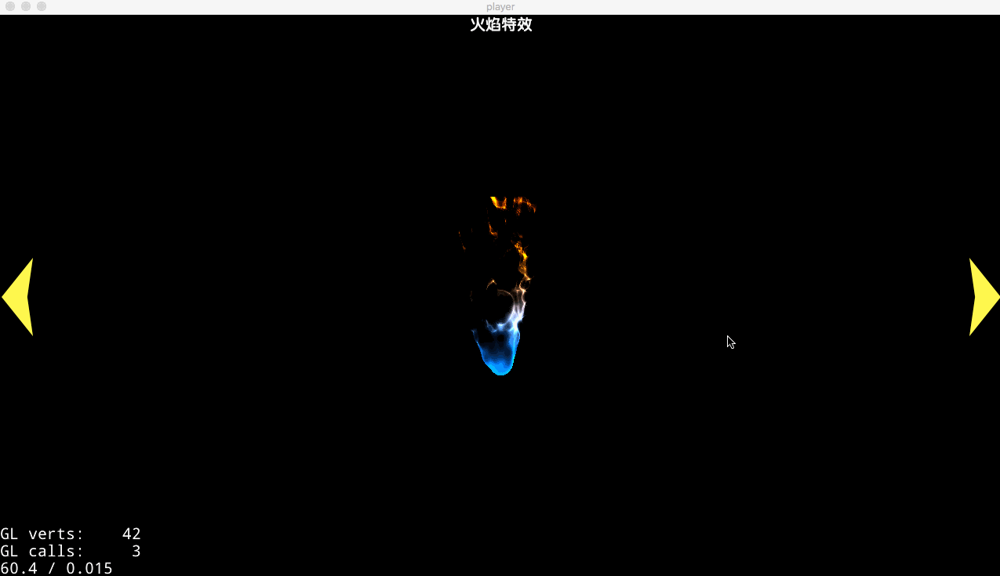

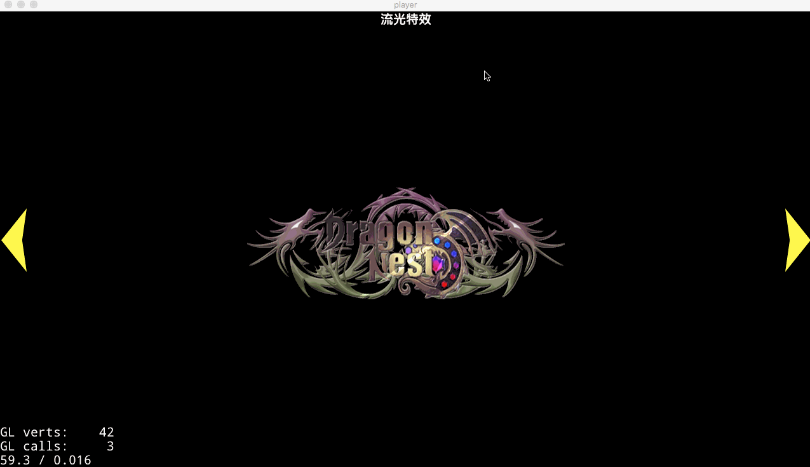

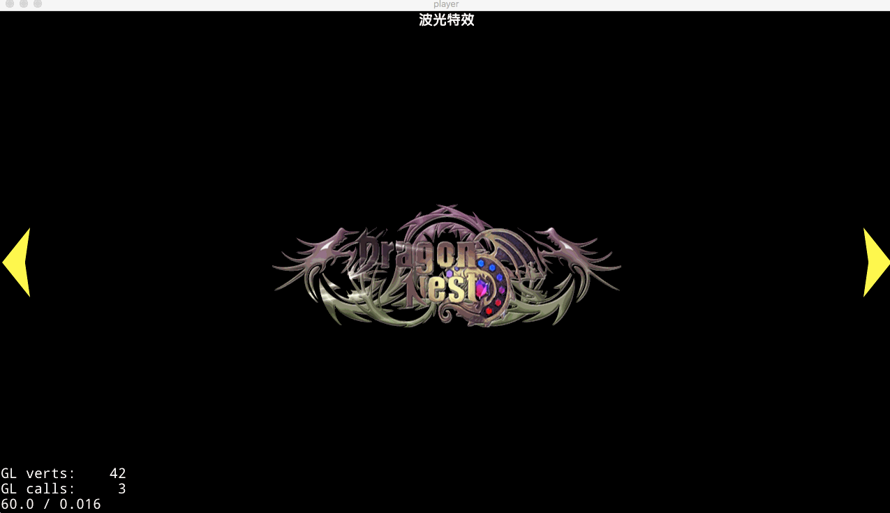

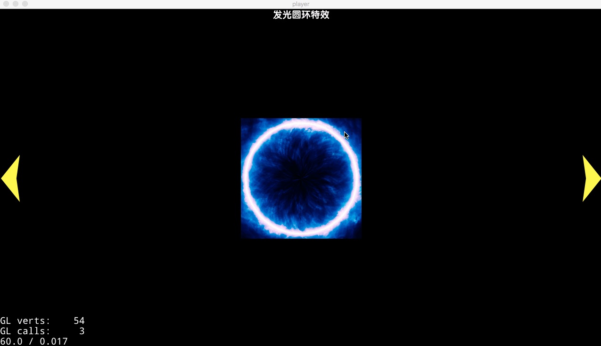

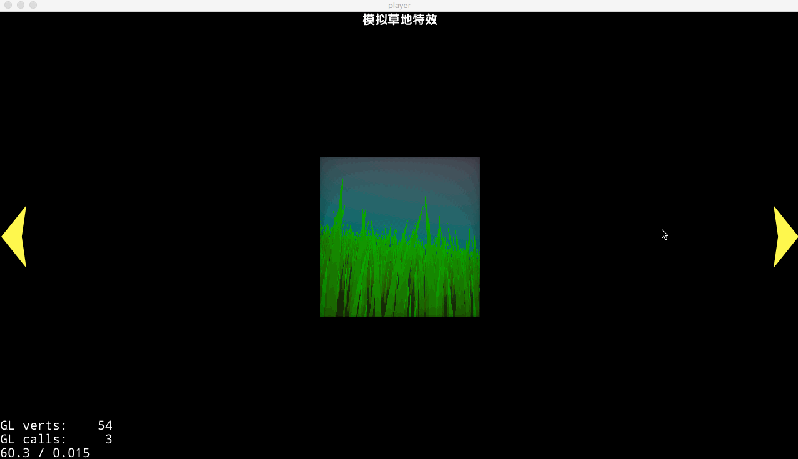

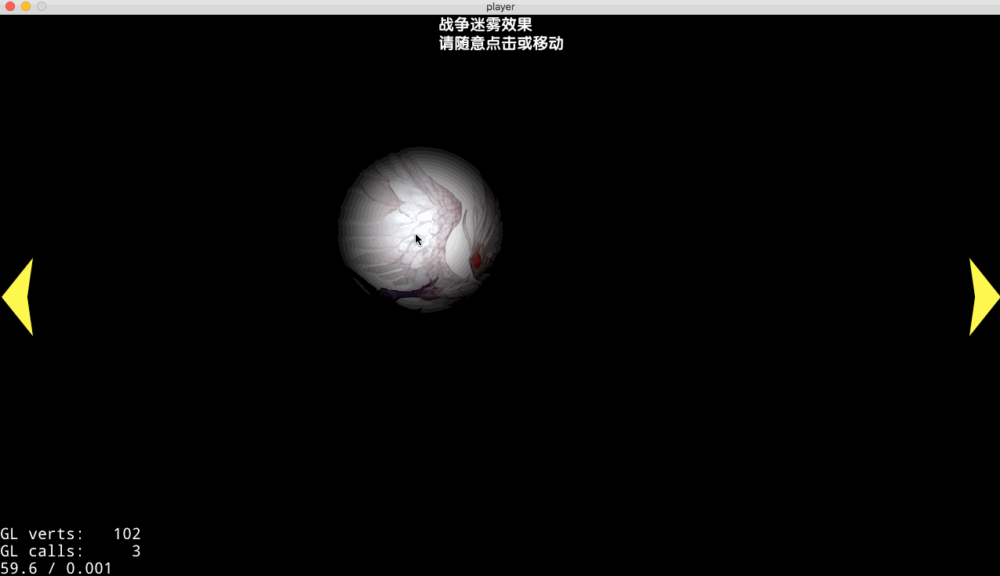

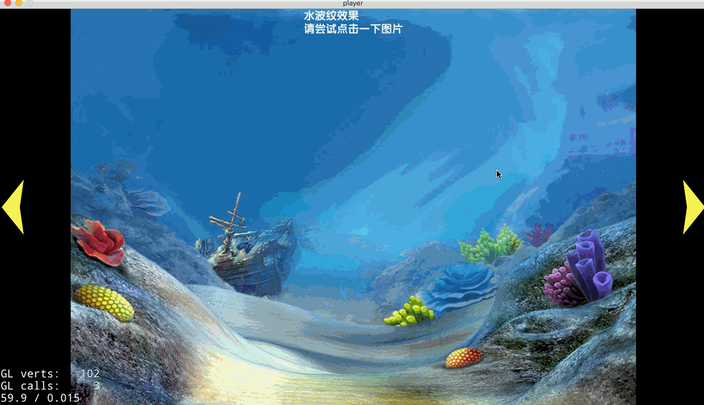

# 最后
1. 请勿用做商用（需要商用的话请联系shader原作者）
2. 请注意shader是有原作者的
3. 我只把自己有兴趣的魔改了，之后还会找其它的效果持续更新。
4. 欢迎star
5. 欢迎到我的博客交流[禹子歆的博客](http://xianwx.xyz/)
